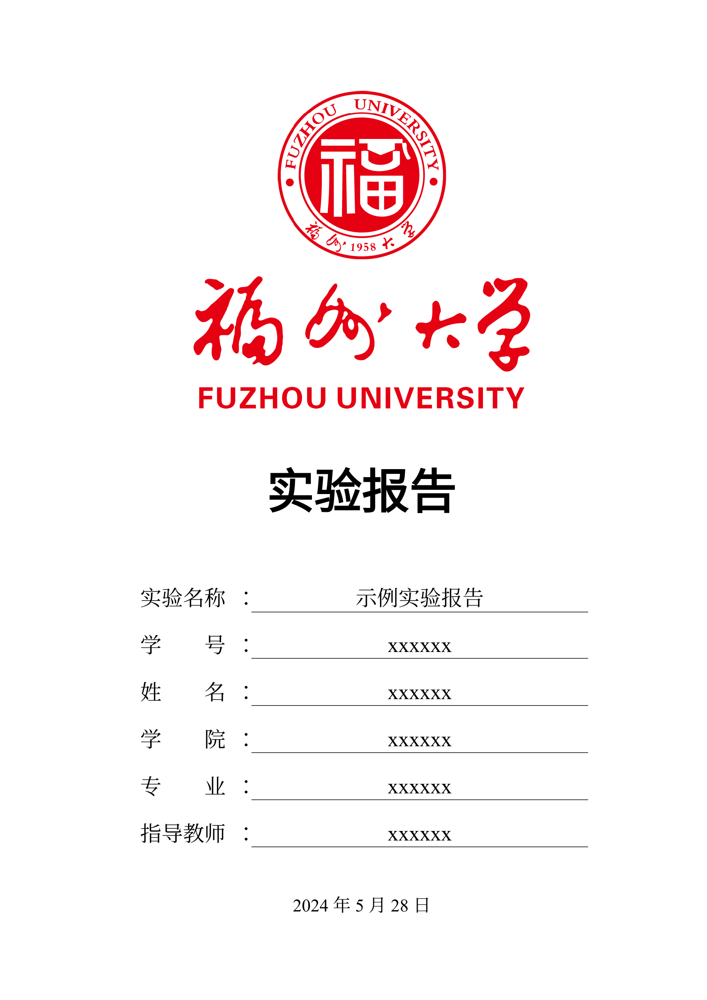

# FZU-report-typst-template

Typst 福州大学实验报告模板 | 自用非官方 | UNOFFICIAL

> [!WARNING]
> 本模板为自用的实验报告模板, 非官方模板. 仅供参考，不保证格式符合要求，使用时请自行检查!!!

本模板为自用模板, 在 [SEU-Typst-Template](https://github.com/csimide/SEU-Typst-Template) 基础上魔改而成的. 

## 预览



## 使用

> [!NOTE]
> 使用前请确保你的系统上已经安装了 `typst`

首先请克隆本仓库

```bash
git clone
```

模板使用的字体库如下

```typst
#let 字体 = (
  仿宋: ("Times New Roman", "Noto Sans Mono CJK SC", "FangSong", "STFangSong"),
  宋体: ("Fandolsong", "Times New Roman"),
  黑体: ("FandolHei", "Noto Sans CJK SC", "Times New Roman",),
  标题黑体: ("SimHei"),
  标题宋体: ("Times New Roman", "STZhongsong", "Fandolsong"),
  楷体: ("FandolKai", "Times New Roman", ),
  代码: ("Cascadia Code", "Fira Code", "Alibaba PuHuiTi 3.0"),
)
```

请确保你的系统上已经安装了这些字体库. 或者你可以根据自己的需要修改 `fzu-report/utils/fonts.typ` 文件中的字体设置.


### 本地使用

> [!NOTE]
> WIP, 这个方法不一定在所有系统上正常工作.
执行

```bash
make
```

若指令工作正常, 应该会将本模板加入到 typst 包管理器中.

此时你可以通过 `@local/fzu-report:0.1.0` 来访问本模板.

运行 `typst init @local/fzu-report:0.1.0` 即可初始化一个实验报告文档.

### 在线使用


> [!NOTE]
> WIP

## LICENSE

本项目基于 MIT 协议开源, 欢迎二次开发

项目中的图标来源于 [simpleicons](https://simpleicons.org/) 和 [iconpark](https://iconpark.oceanengine.com/)